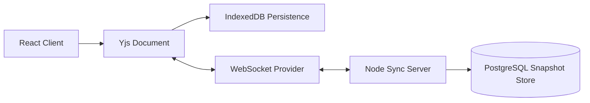

# SyncSpace Architecture

## System Overview

SyncSpace uses a local-first architecture. The browser owns the editing experience, persists CRDT state in IndexedDB, and syncs updates through a WebSocket server when a network path exists.

## Offline-First Flow

1. User edits a note in the React editor.
2. The edit is converted into a Yjs CRDT update.
3. Yjs writes the update to IndexedDB through `y-indexeddb`.
4. If online, `y-websocket` broadcasts the update to other clients.
5. If offline, edits continue locally and sync later.
6. On reconnect, Yjs exchanges state vectors and sends only missing updates.

## Conflict Handling

SyncSpace avoids last-write-wins overwrites. Each client produces CRDT operations with causal metadata. When clients reconnect, Yjs merges operations deterministically so both clients converge to the same final document.

## Backend Role

The current server is intentionally thin:

- accepts WebSocket upgrades at `/sync`
- groups clients by room name
- relays Yjs document updates
- exposes simple HTTP health and workspace routes

For production, add:

- PostgreSQL persistence for document snapshots and update logs
- authentication on HTTP and WebSocket upgrades
- rate limiting
- periodic compaction of CRDT update history

## Scaling Notes

For multiple server instances, WebSocket rooms need shared pub/sub. Recommended options:

- Redis pub/sub for small to medium scale
- NATS for higher throughput event routing
- Durable Yjs persistence with PostgreSQL or object storage snapshots

Presence data should remain ephemeral. Notes and version history should be durable.
